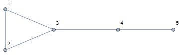
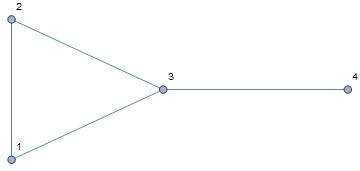
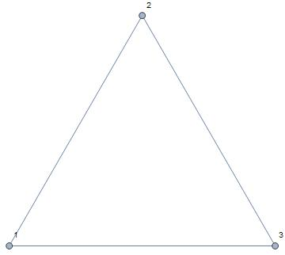
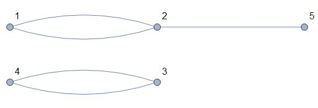
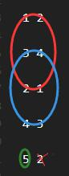
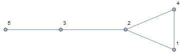
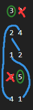

# 一道普通的C语言考试题引发的逼逼

<br>

## 背景
今天在寻里日常说p话的时候看到一道这样的题目：

<hr>

### 题目：
5位选手参加马拉松比赛，分别获得第1、2、3、4、5名，有好事者让5人根据实力，按照下面预测比赛结果。 

A选手预测：自己和B分别获得的名次；

B选手预测：自己和E分别获得的名次；

C选手预测：自己和D分别获得的名次；

D选手预测：自己和C分别获得的名次；

E选手预测：自己和A分别获得的名次。

决赛成绩公布之后，每位选手的预测都只说对了一半，即一对一错。请编程解出比赛的实际名次。

<br>

### 输入：
每个选手的预测（输入格式为`scanf("%d%d"......)`）

<br>

### 输出
（1）如果预测合理，则输出比赛的实际名次（输出格式为`printf("A的名次是：")`，每个名次占一行）

（2）如果预测不合理，则输出：Can't found!

<br>

### 示例1：

输入：

3 2

2 4

1 2

3 5

4 1

<small>（然后之后的就看不见了）</small>

<hr>

如果要说正经解法的话，其实这个问题的要点有两个，第一是确定组合的约束条件，这决定了程序在什么空间里搜索；第二是判断某个组合是否是解，这决定了程序找到解的时候能不能意识到这一点。

由于不是重点，就不详细解释了，贴代码之前这里粗略讲一下。

对于第一个问题，只需要把“对 错”和“错 对”两种情况编码成0和1，这样5个玩家的不同情况就可以被编码成一个**唯一**的五位二进制数，范围显然为00000~11111共32种可能性。这就是我们搜索的空间。

第二个问题，其实只要判断左边（右边）那一列中是不是包含了1~5每个数就可以了。因为如果某个数字没出现或者出现多次，说明名次出现逻辑矛盾（因为这一题中没有并列一说）。这很好理解。至于怎么用代码实现这个判定，有很多种方法，堆`if`也好，搞布尔数组之类的来遍历也好，其实差别不大。我这里用的是编码成五进制数的方法，运行比较快，逻辑比较少，打的字也少一点。

下面是代码。注意我并没有处理无解情况，也没有按照题目的要求输出。想判断无解加个flag就好了，至于输出的话，总之已经找到解了，只需要按照二进制1/0对应的“对错”/“错对”反过来导入相应的名次就可以了。这些活属于擦屁股性质的，何况代码本身也不是重点，我就懒得弄了，只搞核心逻辑。

<br>

```c++
#include <iostream>
int main()
{
    const int A = 0, B = 1, C = 2, D = 3, E = 4, LEFT = 0, RIGHT = 1;
    int input[5][2], solutions[32][5];
    scanf("%d%d", &input[A][0], &input[A][1]);
    scanf("%d%d", &input[B][0], &input[B][1]);
    scanf("%d%d", &input[C][0], &input[C][1]);
    scanf("%d%d", &input[D][0], &input[D][1]);
    scanf("%d%d", &input[E][0], &input[E][1]);
    for (int i = 0; i < 32; i++)
    {
        int col[5];
        int feature_number = 0;
        for (int n = 0; n < 5; n++)
        {
            int digit = i >> n & 1;
            if (digit == 0) col[n] = input[n][LEFT];    //对-错
            else            col[n] = input[n][RIGHT];   //错-对
            feature_number += pow(5, col[n] - 1);
        }
        //判断是否是解：
        if (feature_number == 781)   //五进制数11111
            printf("\nSolution[%d]: %d %d %d %d %d\n", i, col[A], col[B], col[C], col[D], col[E]);
    }
}
```
回过头来看这个题目输出的要求，貌似只需要输出一个解就可以了，甚至它其实希望考生遍历全部`5!=120`种情况然后碰到合适的就直接输出也是有可能的，毕竟120真的也不多。总之，上面这样做可以用32次不重不漏地输出所有的解。所以其实虽然只有这么点代码，但是如果只是单纯要求能过的话，写出来理论上只会更加简单。

<br>

## 进入正题

随便乱输入了几个组合跑了几下，发现一个有意思的事情。每次找到的解的数量要么是2个，要么是4个，总之都是偶数个。隐隐感觉这些解好像是成对的。突然觉得好奇，这个东西背后有什么数学上的原因吗（废话当然有）？能不能证明它？

首先，“成对”其实就意味着解和解之间暗藏着某种至少是广义上的变换关系。即，存在某种方法可以把一个解变换成另一个解。

想到这，第一个自然的想法是观察编码的二进制数之间的关系。指不定是啥简单的基本运算呢。然而，多试了几个例子你就会发现，单单看这个看不出什么明显的变换关系，至少效果并不会比直接观察两个解要好——看这玩意能看出来的一些小结论，直接看两个解本身也能看出来。

观察法没有给出很多有价值的信息，那我们就直接进入下一阶段，想办法从分析的角度理解它。**要理解每一个解，不妨试着学会构造一个解。**

现在让我们观察下面这组由我亲自捏造的输入：

1 2

2 3

3 1

4 3

5 1

根据上述程序（或者也可以不根据上述程序，因为实在太明显了），它有两个解：

`1 2 3 4 5     编码：00000 0`

`2 3 1 4 5     编码：00111 7`

两个解的末尾都是45，这是为啥呢。原因在于，4、5在输入的这一堆数里均只出现过一次，这实际上意味着我们毫无选择——“对错”之中，它们必须是“对”的那个，因为解的要求是**1~5每个数出现且仅出现一次**。如果这样的数是错的，那么得到的解就没有4和5了。

至此就可以分析出，解必然是“xxx45”形式的。容易意识到，具有这种性质的数在解中是稳定出现的，属于固定点，我把它叫作一个“锚点”。在这个例子里，4和5就都是锚点，因为它们都只出现了一次，**舍我其谁**。

于是，就有了构造一个解的第一步：

### 1.将所有锚点标记出来


1 2

2 3

3 1

**4** 3

**5** 1

<br>

既然论证了锚点必然具有正确性，和它相对的数也就必然具有错误性，毕竟只有“对错”或者“错对”两种可能。这就意味着，我们不需要再把它纳入考虑范围。因为它不可能再为解空间贡献任何元素了，可以非常安全地划掉它。这是构造解的第二步。

### 2.划掉所有和锚点点相对的数

1 2

2 3

3 1

**4** <s>3</s>

**5** <s>1</s>

<br>

为啥一定要划掉呢？要理解这一点，来看另外一种输入：

1 2

2 3

3 1

4 3

5 <i>4</i>

<br>

这货和上面那个输入相比只改变了一个数字，即5对面的数字改成了4。这个改动带来的直接影响是，现在4不是锚点了，因为它出现了两次。当然，我们仍然可以标记5并划掉它对面的数：

1 2

2 3

3 1

4 3

**5** <s>4</s>

<br>

但是注意，一旦当我们划掉4，4实际上又变成只出现一次了。真好，这意味着它其实还是锚点，我们就可以接着标记它，然后划掉它对面的数。

1 2

2 3

3 1

**4** <s>3</s>

**5** <s>4</s>

<br>

这个过程和总行数并没有关系，因此对于任意n个运动员的情况，每标记一个锚点，总可以通过这种操作把考虑的行的个数约化到n-1的情况。也就是说，上面这样的操作可以无限重复，直到找不到任何一个锚点为止。这样每一个原则上必须固定的点都可以被找到。因此，构造解的第一步可以总结为：

### 1.将所有锚点标记出来，划掉对面的数，无限重复直到锚点不存在

<br>

下一步是什么呢？我们刚刚研究了固定点，现在看看除了这些所谓的锚点之外还剩啥：

1 2

2 3

3 1

<br>

规则的序列。似乎具有某种环的性质，具体来说，是1->2->3->1这个环。还有其它可能性吗？比如，试着换掉其中某个数字：

1 2

2 <i>1</i>

3 1

<br>

但是，如果是这样的话，就还能找到一个锚点——第三行的3，这和我们假设系统不存在锚点的前提不符。而一旦继续标记这个3，剩下的

1 2

2 1

<br>

又还是一个环，具体来说是1->2->1。这就不免让人产生一些猜想了。事实上，可以简单证明，当所有锚点都被排除考虑之后，剩下的部分必定是“环”的结构。

首先需要知道，每标记一个锚点，会在固定一个数字的同时排除掉一行，行数和非固定的数总是同时减去1，因此**只要一开始的n行之中包含了全部的1~n共n个数字**，那么无论这个过程进行了多少次，最终结果一定还是n-x个数字出现在n-x行之中，这导致 **剩余数字的个数和剩余行数总是相等的**。比如上面的例子中，1和2两个数分布于两行之中，以及再往前，1、2、3三个数分布于三行之中。（至于如果一开始的n行之中就不包含全部的1~n，那显然这是无解情况，根本不可能构造出哪怕半个解，也压根不需要进一步分析）

此时再回顾所谓“锚点”的定义——他们是逻辑上只出现过一次的数。排除掉所有锚点，意味着剩下每个数都出现了至少两次。由于每一行有**两**个数字，结合上一段的结论，现在是n个数字填到**2n**个空里，而且每个数字还至少出现两次——嗯，所以每个数字当然只可能出现了**恰好**两次。

进一步推论，由于每个数都出现了两次，总能将这些数字以一个或多个的“A->B->C->...->A”的形式表示出来。这不就是所谓的“环”咯。

从“环”中，我们就可以轻易看出解的变换——其实就是在环链上的一次轮换。例如上面出现过的


`1 2 3 4 5     编码：00000 0`

`2 3 1 4 5     编码：00111 7`

第二个可能“2-3-1”其实就是“1-2-3”在环“1-2-3-1”上轮换一次的结果罢了。显然，一次轮换操作可以提供一种额外顺序，所以每存在一个环就可以为最终解提供两种顺序。当输入中只有一个环时，可能性就是2；当输入中有两个环，这两种顺序组合在一起的可能性就是2*2=4。同时，可以推广到n个环，总数将是2的n次幂。

其实至此猜想就得到证明了，而且有点出乎意料的是，证明得到的结论比一开始的猜想还要强。可还有更有意思的事情。到了这里，说实话关子已经卖得有些刻意了，某些人可能早就想问了或者已经自己想明白了：**我说的这个环，它跟图论里面的环，是不是同一个玩意？**

答案当然是肯定的。直接把输入当成图（graph）里的顶点和边输入Mathematica画一画，就啥都明白了：

输入：

1 2

2 3

3 1

4 3

5 4

<br>

代码：

```mathematica
Graph[{1 \[UndirectedEdge] 2, 2 \[UndirectedEdge] 3, 
  3 \[UndirectedEdge] 1, 4 \[UndirectedEdge] 3, 
  5 \[UndirectedEdge] 4}, VertexLabels -> Automatic]
```

<br>

输出：



<br>

回想我们对这个输入构造解的过程：先标记5，然后删除一个4；接着就可以标记4，删除4相对的3。最后剩下一个1、2、3构成的闭环。

放在这张图里，可以更直观地理解我们的操作过程。不难看出，之前归纳出来的“锚点”其实就是图中不成环的端点，或者俗一点，叫“毛边”。而标记端点然后删除其对面的数的过程，本质上是从图中移除掉一个端点和与之相连的边。在这个例子中，我们在固定5的同时删除对面的4：


1 2

2 3

3 1

4 3

**5** <s>4</s>

<br>

画出结果：

```mathematica
Graph[{1 \[UndirectedEdge] 2, 2 \[UndirectedEdge] 3, 
  3 \[UndirectedEdge] 1, 4 \[UndirectedEdge] 3}, 
 VertexLabels -> Automatic]
```

<br>

可以得到图



<br>

注意这时，4变成新的端点了。上述过程可以继续重复。直到出现一个完美的环



因此，根本上，之前所说的第一步：

<br>

>将所有锚点标记出来，划掉对面的数，无限重复直到锚点不存在

其实就是从端点出发，慢慢把整张关系图里的所有“毛边”全部啃掉，让整张图只剩下环。

这为我们提供了快速判断解的数量的方法：画出图然后数其中环的个数。在存在n个环的情况下，解的数量为2<sup>n</sup>。

<br>

例如，输入

1 2

3 4

2 1

4 3

5 2

<br>

对应的图为



有两个环，所以会有4个解。别看现在5个运动员的情况只用肉眼也可以判断，这种方法的威力在于理论上推广到n个运动员都是可行的。

至于构造具体的解的话，只需要用圈圈把这些环圈出来：



然后在锚点不动的基础上，按照圈圈轮换组合即可。

<br>

再比如原题目中给出的示例情况

3 2

2 4

1 2

3 5

4 1

<br>

相应地可以画出



因此解有两个。这个输入的圈圈得这么画：



然后锚点固定，环轮换，就可以得到那两个解。

<br>

## 结论
就是说，解的个数不但是偶数，而且还是2的整数次幂。这个次数是输入数对构成的图中的环的个数。另外在证明过程中，顺便提出了一套完整的构造+变换解的实用方法，并且可以推广到任意n个运动员的情况。

再回过头来看原问题，明明是个小学奥数逻辑题，说实话本人第一反应也是无脑假设法，没想到探究下来还能和图论扯上关系。嗯，至此这个问题到这里也就被扒得底裤都不剩了。
