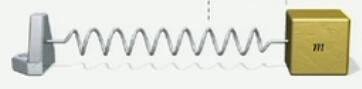

<head>
    
    
</head>

# 波动：简谐运动（1）

## 概念

总的来说，当物体的加速度满足：

1. 和位移成正比
2. 方向相反

这个物体运动的方式就是SHM。

上述条件可以快速写成一个动力学方程：
$$\frac{\mathrm{d} ^2x}{\mathrm{d} t^2}=-k.x$$

 

应该注意到，尽管这个要求其实很严格，但是基于“一小段曲线可以用直线近似”的化曲为直思想， 在一阶近似下，只要存在回复力，不管其是否满足和位移成正比的关系，在充分小的形变范围内均可以近似为简谐运动。

最简单的例子，即弹簧-质量模型。弹簧的一端连接了一个有质量的物体。由于回复力（restoring force）——以及相应地，加速度——与位移成正比且方向相反，此时物体就会做简谐运动。

若弹簧的劲度系数为k，根据胡克定律（和牛顿第二定律），在这个例子中，上述方程可写为：$$m \frac{\mathrm{d} ^2x}{\mathrm{d} t^2}=-k.x$$

$$\frac{\mathrm{d} ^2x}{\mathrm{d} t^2}=-\frac{k}{m}.x$$

 

从而得到该质量的运动方程。

这个方程的一个解是正（余）弦波，例如：
$$x=A \cos (\omega  t+\delta )$$

 

其中：

* A是振幅
* $\omega  t+\delta$是运动的相位
* $\omega$是角频率，单位通常为弧度每秒
* $\delta$是**相位常数**，单位一般为弧度。往往可以通过选定初始条件来把这一项调成0

 

上述方程可以用复数表示成：

$$x=A e^{i (\omega  t+\delta )}$$

我们可以把这个解带回去看看$\omega$是啥：

$$\begin{aligned}
\frac{\mathrm{d} ^2(A \cos (\omega  t+\delta ))}{\mathrm{d} t^2}=-\omega ^2 A \cos ( \omega t +\delta )=-\omega ^2 x 
\end{aligned}$$

$$-\frac{k}{m}.x = -\omega ^2 x$$

$$\omega =\sqrt{\frac{k}{m}}$$

而当具有足够的初始条件，我们可以用这个运动方程计算运动量，例如速度、位置等。

 

> A mass of 2 kg on a horizontal spring of k = 100 N/m is given an initial displacement of 10 cm at t = 0. What will be the maximum speed of the subsequent motion?

这题里`m = 2kg`，`k = 100 N/m`，而初始位移则决定了x的振幅`A = x_0 = 0.1m`。

使用上述通解，$\omega = \sqrt{k/m}=7.1 {\rm rad/s}$，另一方面，速度可以通过对$x$积分得到，因此

$$v=\frac{d x}{d t}=-A \omega \sin(\omega t)$$

 

速度的最大值即这个方程的振幅$A \omega = 0.7 {\rm m/s}$。

 

## 初始条件

将`t=0`分别代入x和v的表达式：

$$x_0 = A \cos \delta $$

$$v_0 = -A \omega \sin \delta $$

 

要素察觉。利用三角函数的一些关系，可以得到一些结论。首先上下相除则有：

$$\tan \delta = - \frac{v_0^2}{\omega x_0}$$

 

其次，使用正余弦平方和为1的关系，可以得到：

$$x_0^2 + \frac{v_0^2}{\omega^2} = A^2$$

 

这两个表达式提供了振幅、相位常数与初始位移、初始速度的直接关系。如果知道了其中任何两个，就可以利用这个关系快速算出另外两个。

 

>There are 4 mass/spring systems. Rank them in order of decreasing angular frequency

* A) with mass m and spring const k
* B) with mass 2m and spring const k
* C) with mass m and spring const 2k
* D) with mass 2m and spring const k/2

 

即使不看公式也可以从直觉上知道，更大的k意味着更高的角频率，而m恰恰相反。从公式定量地说，**角频率与k/m的平方根成正比**。

由于$\sqrt{}$的单调性，只需算出k/m比较就可以。C)和D)显然是两个极端，而A)和B)的区别则在于B)更沉，故答案选2。

## 能量

弹性势能表达式：

$$U = 0.5 k x^2$$

 

另一方面，我们还有$x=A\cos(\omega t + \delta)$，代入可得：

$$U=0.5kA^2\cos^2(\omega t + \delta)$$

 

对动能故技重施，我们可以知道：

$$KE=0.5m\omega^2A^2\sin^2(\omega t + \delta)$$

 

之前证明过$\omega^2=k/m$，可以用来进一步消掉m：

$$KE=0.5kA^2\sin^2(\omega t + \delta)$$

 

则总机械能就是这俩加起来：

$$E_{total}=\frac{1}{2}kA^2[\sin^2(\omega t + \delta)+\cos^2(\omega t + \delta)]$$

 

从而

$$E_{total}=\frac{1}{2}kA^2$$

这个结果还是相当优雅的，用中文可以表述为，简谐运动中的总能量与振幅的平方成正比。
      

### [目录](./index.md)
### [首页](../index.html)