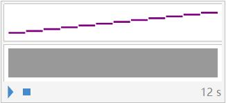
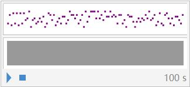
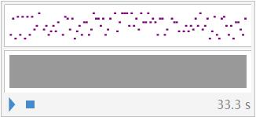
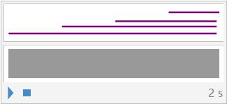
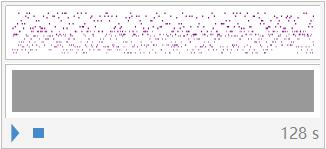

# 用数字造乐曲

## 第一步：获取常数的任意位
要把常数编码成乐谱，必须要有办法获取某个实数的任意位。Mathematica的内核可以使用无限精度的计算算法，因此它当然集成了一个单独的函数`RealDigits`，使用它我们就可以得到任意实数在某一位的数值或在某个区间内数值构成的列表。例如，获取e在十进制下前100位的数字列表：  
```mathematica
RealDigits[E, 10, 100]

(*输出：{ {2, 7, 1, 8, 2, 8, 1, 8, 2, 8, 4, 5, 9, 0, 4, 5, 2, 3, 5, 3, 6, 0, 2,
   8, 7, 4, 7, 1, 3, 5, 2, 6, 6, 2, 4, 9, 7, 7, 5, 7, 2, 4, 7, 0, 9, 
  3, 6, 9, 9, 9, 5, 9, 5, 7, 4, 9, 6, 6, 9, 6, 7, 6, 2, 7, 7, 2, 4, 0,
   7, 6, 6, 3, 0, 3, 5, 3, 5, 4, 7, 5, 9, 4, 5, 7, 1, 3, 8, 2, 1, 7, 
  8, 5, 2, 5, 1, 6, 6, 4, 2, 7}, 1}*)
```
我也没搞懂为什么返回的是一个嵌套列表，这个列表的第一个元素是期望的结果，第二个元素是个1。不过从中提取出我们想要的结果也非常简单，直接在前面加上`First@`或者在后面加上`[[1]]`就行了：
```mathematica
First@ RealDigits[E, 10, 100]

(*输出：{2, 7, 1, 8, 2, 8, 1, 8, 2, 8, 4, 5, 9, 0, 4, 5, 2, 3, 5, 3, 6, 0, 2, 
8, 7, 4, 7, 1, 3, 5, 2, 6, 6, 2, 4, 9, 7, 7, 5, 7, 2, 4, 7, 0, 9, 3, 
6, 9, 9, 9, 5, 9, 5, 7, 4, 9, 6, 6, 9, 6, 7, 6, 2, 7, 7, 2, 4, 0, 7, 
6, 6, 3, 0, 3, 5, 3, 5, 4, 7, 5, 9, 4, 5, 7, 1, 3, 8, 2, 1, 7, 8, 5, 
2, 5, 1, 6, 6, 4, 2, 7}*)

RealDigits[E, 10, 100][[1]]

(*输出同上*)
```
<small>(这里有个技巧，`[[`和`]]`，在Notebook里面可以通过先按一次`Esc`，输入`[[`或`]]`，再按一次`Esc`来缩小成一个单独的符号。当方括号很多很乱时这个技巧会异常有用。)</small>  
<br><br>

## 第二步：将数字变成音符
在这个任务上，我们有两个思路：
1. 用`Audio`把数字转换成特定频率、特定波形的声音；
2. 用`SoundNote`把数字转换成特定乐器的特定音调

这俩货的区别就在，`Audio`的频率更灵活，但只能生成方波、正弦波之类的~~难听~~波形；`SoundNote`的频率仅限十二平均律中划分出的那些声调(**C D E F G A B**)，但可以直接生成MIDI乐器的音色。

鉴于我们想制造的**是**音乐(起码是**像**)，而不是奇怪的扫频声，我们在这里选择后者。

根据`SoundNote`的[文档](https://reference.wolfram.com/language/ref/SoundNote.html)，`SoundNote[N]`代表输出距离中央**C**（即**C4**）N个半音的音符。比如，`SoundNote[1]`将会输出音符**C#4**，而`SoundNote[12]`会输出音符**C5**,默认使用的乐器为钢琴。下面这行代码会从中央C开始一次弹奏一个键，一直弹完一个八度：
```mathematica
Sound[SoundNote/@ Range@ 12]
```
输出：  
  
<audio src="./media/0000.mp3" controls="controls">输出结果</audio>

此处`Sound`函数的作用只是单纯地把一个音符的列表转换成对应的声音，没什么好说的。

了解到这里，一个很自然的想法大概就是，直接把`SoundNote`逐项作用于第一步我们得到的那个列表，然后再用`Sound`播放它。让我们来试试：
```mathematica
list = First@ RealDigits[E, 10, 100];
Sound[SoundNote/@ list]
```
输出：  
  
<audio src="./media/0001.mp3" controls="controls">输出结果</audio>

听听这个输出结果，能明显感觉到两个问题：
1. 每一个音符的时间太长了
2. **难听！**

第一个问题很好解决，`SoundNote`默认情况下输出的音符长度为1秒，我们只需要为它额外指定一个自变量表示时长即可。举个例子，`SoundNote[N, t]`会输出一个**C4**+N个半音、时长为t秒的音符。一秒钟三个音似乎挺合适的，所以就选个0.333好了。

至于第二个问题，要解决它需要知道为什么难听。

由于`SoundNote`函数输出的音符以半音为单位，输出的“乐谱”会包含大量的升调和降调，这会使得旋律很容易听起来不协调。实际上，因为每一位数字的范围都是0~9，这会导致**很有可能是正规数**的e或者π输出**C**调音符和非**C**调音符的可能性接近五五开...

那么我们可以想个办法，只输出**C**调音符吗？

当然可以，只要做一个简单的映射就可以了。**C**调的音符分别在**C**之后第2、4、5、7、9、11个半音处，对应我们熟悉的re、mi、fa、sol、la、si，至于do，当然就是0了。因此，我们可以用这样的一个规则集合来表示这种对应关系：
```mathematica
rule = {1 -> 0, 3 -> 4, 4 -> 5, 5 -> 7, 6 -> 9, 7 -> 11};
```
如果只是简单地这样操作，有几个小问题。首先，do到si只有七个音，而十进制数字范围是0~9，这样映射将会浪费0, 8和9。我能想到的解决方法有两种：
1. 缩小定义域。把π按照七进制输出，这样每一位数的范围就正好是0~6共七个数字了，可以完美实现一一对应。
   
2. 扩大值域。继续往外映射**C**调音符，直到把十个可能的数字都用完。比如8就对应下一个八度的do。

我选择了第二种方法。因为用七进制固然是方便，问题是这样输出的数位没有了3.1415926535...和2.718281828459...这些熟悉的序列带来的情怀——不管是单纯地在屏幕上看到，还是在音调的高低中听到。

~~七进制下的π是3.066365143...，这是哪里来的野🐔？总之我不认识👎~~

第二个小问题是，这样产生的序列会从头演奏到尾，缺少休止符。这个就简单了，把0转换成休止符本身就再合适不过了。于是，我们的规则完善成：
```mathematica
rule = {1 -> 0, 3 -> 4, 4 -> 5, 5 -> 7, 6 -> 9, 7 -> 11, 8 -> 12, 9 -> 14, 0 -> None};
```
整段新代码就是在原来的基础上，用这个`rule`处理了一下`list`：
```mathematica
rule = {1 -> 0, 3 -> 4, 4 -> 5, 5 -> 7, 6 -> 9, 7 -> 11, 8 -> 12, 9 -> 14, 0 -> None};
list = First@ RealDigits[E, 10, 100] /.rule;
Sound[SoundNote[#, 0.333]& /@ list]
```
输出：  
  
<audio src="./media/0002.mp3" controls="controls">输出结果</audio>

结果听起来好多了！但是只有一只“手”在演奏，未免有些单调。让我们用相同的方法把π也加进去一起玩耍，π可以作为更慢的声部，而e的声部的节奏是前者的两倍：
```mathematica
length = 256;
t = 0.5;
pi = First@RealDigits[Pi, 10, length] /.rule;
```
前两行定义了两个变量length和t，修改它们就能直接控制输出的乐谱的长度和每个音符的时长了。

要共同演奏，如果两边的音调都一样，首先不符合乐器的实际（正常人不会两只手叠一起弹琴嘛），其次不好听，不妨再想个办法把e降个八度，变成左手的“伴奏”。由于一个八度是十二个半音（十二平均律），给e降八度只需把e的每一位减去12即可：
```mathematica
e = If[IntegerQ@#, # - 12, #]& /@ (First@RealDigits[E, 10, 2 length] /.rule);
```
其中的`If[IntegerQ@#, # - 12, #]&`是一个匿名函数，它只在自变量是整数时才将其减去12，其他时候会原样输出。之所以需要这一步处理，是因为经过`rule`的映射，其中可能存在休止符`None`，而它是不能被降八度，也就是减去12的。理解了这一步，这行代码的其他部分都十分浅白。

这里e的音符个数是`2 length`，是π的两倍。这是因为e声部速度是两倍，则单个音符的时长是π的一半，所以我们需要多一倍的音符个数来保证乐谱长度相等。

那么如何实现同时演奏呢？这里要用到`SoundNote`的第三种用法——`SoundNote[N, {from, to}]`会输出一个**C4**+N个半音、从整个谱子第`from`秒开始，持续到第`to`秒结束的音符。例如，下面这行代码会依次按住**C4**、**E4**、**G4**、**C5**四个键，共持续两秒：
```mathematica
Sound@ {
    SoundNote["C4", {0, 2}], 
    SoundNote["E4", {0.5, 2}], 
    SoundNote["G4", {1, 2}], 
    SoundNote["C5", {1.5, 2}]}
```
输出：  
  
<audio src="./media/0003.mp3" controls="controls">输出结果</audio>

这样，任意列表list中的第N个音符可以表示为
```mathematica
SoundNote[ list[[N]], {N*t, (N+1)t}]
```
这是因为，每个音符时长t秒，所以到第N个音符时应该会从第Nt秒开始响t秒，即区间\[Nt, Nt+t\)。
从而，乐谱列表可以分别使用一个简单的`Table`来得到：
```mathematica
piNote = Table[SoundNote[pi[[i]], {t (i - 1), t*i}], {i, length}];
eNote = Table[SoundNote[e[[i]], {t/2 (i - 1), t/2 i}], {i, 2 length}];
```

最后将两个乐谱连接到一起，用`Sound`输出音频：
```mathematica
mid = Sound@ Join[piNote, eNote]
```
输出：  
  
<audio src="./media/0004.mp3" controls="controls">输出结果</audio>

也可以通过为`SoundNote`添加第三个参数来改变乐器，比如加上`"Violin"`来指定输出的乐器为小提琴。不过我就不演示了，~~钢琴挺好的❤~~。<br><br><br><br>

### 听起来还挺催眠的 
<br><br><br><br><br>
<hr>

### [上级](../)
### [首页](../../index.html)
### [下一篇](./404.html)
