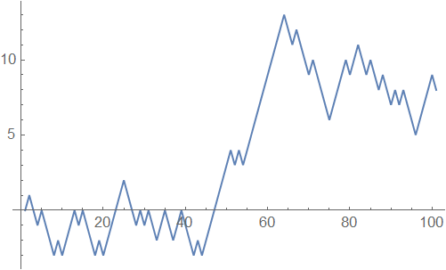
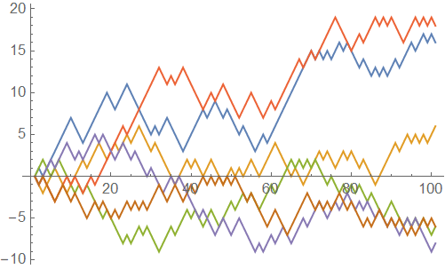
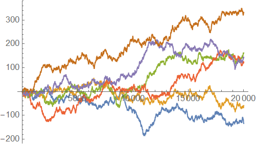
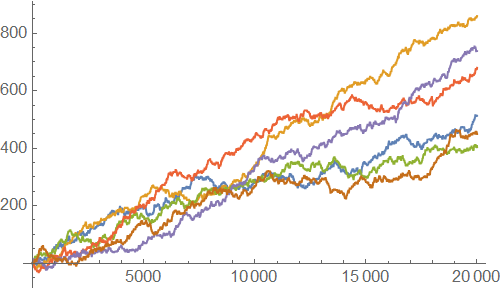
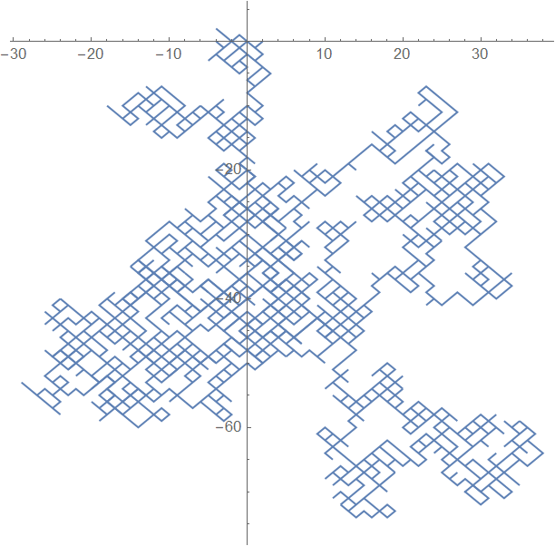
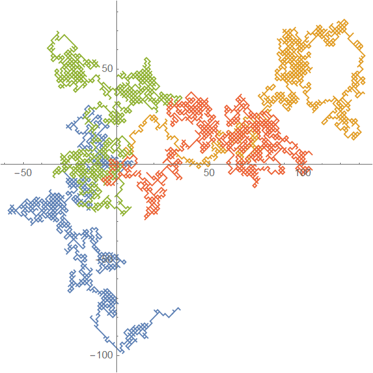
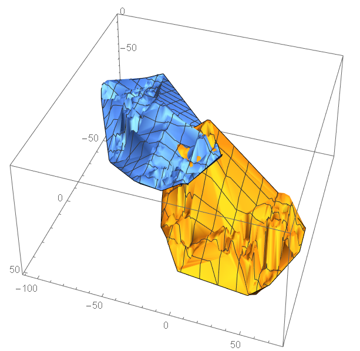
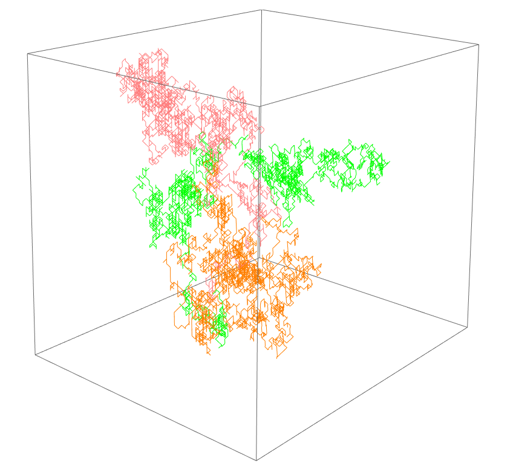
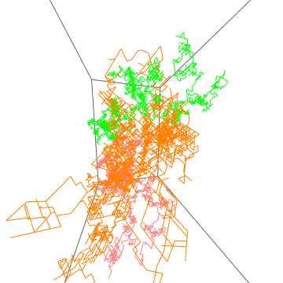

# 随机游走的可视化Playground

## 一维情形
背景是我弄出了一个函数，它可以产生一个起始点为`startPosition`、长度为`n`的一维随机游走序列。其中，向两个方向移动的概率由一个满足分布`dist`的随机变量**X**决定，当**X**大于0.5时向正方向移动，vice versa。代码如下：

```mathematica
randomWalk1D[startPosition_, n_, dist_] := Block[{xs},
  xs = {startPosition};
  Do[xs = Append[xs, Last@xs + If[RandomVariate@dist > 0.5, 1, -1]], 
   n]; xs]
```

这样，只要我们有一个现成的概率分布，例如

``` mathematica
dist = BinomialDistribution[1, 0.5];

(*p=0.5、n=1的二项分布，即最原始版本的随机游走模型*)
```

则画出随机游走图形可以直接用如下的一行解决：

```mathematica
ListLinePlot @ randomWalk1D[0, 100, dist]

(*画出100步的轨迹*)
```

输出结果：



也可以用`Table[expr, n]`函数计算多条轨迹然后画在一起：

```mathematica
ListLinePlot @ Table[randomWalk1D[0, 100, dist], 6]

(*画出100步的轨迹，重复6次列表*)
```

输出结果：



我萌增加n到20000看看是啥效果：



当然也可以修改随机变量满足的分布，理论上只要你能写出PDF或者CDF的概率分布都是可以用的。这里演示一下使用均值0.9、标准差为10的正态分布下的情况：

```mathematica
norm = NormalDistribution[0.9, 10];
(*正态分布有现成的内置函数可以用，所以不用自己写PDF*)

ListLinePlot[Table[randomWalk1D[0, 20000, norm], 6]]
```

输出结果：



结果看起来还挺酷的，尤其是n=100、六条轨迹画在一起那一张，已经有点维基百科里面的示意图内味了。但是更酷的在后面：一维的情况整完了，吃饱了撑的我们自然就会开始思考...

> 怎么把这个函数推广到n维呢？

机智的我已经提前考虑到这个问题，并且把它写好了。其实就是把自变量向量化，然后做一点*微小*的调整，以及增加了一点中间变量（以保证代码组织有序）：

```mathematica
randomWalk[startPosition_, n_, dist_] := Block[{xs, rv, mv},
  xs = {startPosition};
  Do[
   rv = RandomVariate[dist, startPosition // Length];
   mv = If[# > 0.5, 1, -1] & /@ rv;
   xs = Append[xs, Last@xs + mv]
   , n]; xs]
```

这个函数可以生成**任意维度**下的随机游走序列。比如，画个二维随机游走只需要一行：

```mathematica
ListLinePlot[randomWalk[{0, 0}, 3000, dist], AspectRatio -> 1]

(*长度为3000次*)
(*自变量{0,0}自动决定了输出结果为二维*)
```

输出结果：



多条轨迹画在一张图仍然可以用`Table`快速解决：
```mathematica

ListLinePlot[Table[randomWalk[{0, 0}, 3000, dist], 4], AspectRatio -> 1]

(*一次画四条轨迹*)
(*即使是i7-9750H，这东西也得跑大概10秒才能出结果*)
```

输出结果：



既然是n维，不妨再试一下三维的情况。三维情况下画图的函数需要稍微改动一下。我研究了一下Mathematica的文档，综合来看有两种选择，一是`ListPlot3D`，画出来的是实体图形；二是使用`Graphics3D`，这样可以画出三维空间中的线。

```mathematica
ListPlot3D[Table[randomWalk[{0, 0, 0}, 3000, dist], 2], AspectRatio -> 1]

(*ListPlot3D[]画出来的是三维面*)
```

输出结果：


这个做法弄出来显然不是很好看，而且这些点集是有序的，本质上就不是平面，用这种方式画出来有违初衷。所以，不妨试一下`Line`的方法。

这一回很遗憾，不能再优雅地一行解决了——因为`Graphics`以及`Graphics3D`函数和`Plot`系函数不同，没有自动调整颜色的功能，所以需要手动定义。

<small>（当然，你实在想一行写完，把`style`代进第二行也不是不行，只不过大家看完代码会默默在心里骂你傻逼而已👍）</small>

```mathematica
style = {Pink, Blue, Orange};
(*定义颜色列表*)

Graphics3D[
 Table[List[style[[i]], Line[randomWalk[{0, 0, 0}, 3000, dist]]], {i, 1, 
   3}], AspectRatio -> 1]


```
输出结果~~令人震惊~~：



投影看不出三维结构，所以再来个动画版：



我还能说啥呢？Mathematica牛逼就完事了。


<br>

## 彩蛋

在研究怎么输出3D视角动图的时候，我找到了Stack Exchange的一个[相关问题](https://mathematica.stackexchange.com/questions/4537/rotating-3dplot-into-animated-gif)。这个问题只有一个回答（但是确实完美提供了解决问题的必要信息），回答本身和评论都把我给看乐了。由于回答是动图，所以我就不放在这里了。各位可以跟随链接自行围观。

另外附上生成动图的完整代码。为了让视角运动平滑并且轨迹合适，我还是研究了好一会的，尤其是要设计并调整`ViewVector`的参数方程：

```mathematica
style = {Pink, Green, Orange};

lines = Table[
   List[style[[i]], Line[randomWalk[{0, 0, 0}, 3000, dist]]], {i, 1, 3}];

td = Table[
   Graphics3D[lines, AspectRatio -> 1, SphericalRegion -> True, 
    ViewVector -> { 80 Sin[t], 80 Cos[t], 0}], {t, 0, 2 Pi, Pi/30}];

Export["animated.gif", td, "DisplayDurations" -> 0.04, "AnimationRepetitions" -> \[Infinity]]
```


<br><br><br><br><br>
<hr>

### [上级](../)
### [首页](../../index.html)
### [下一篇](./404.html)
