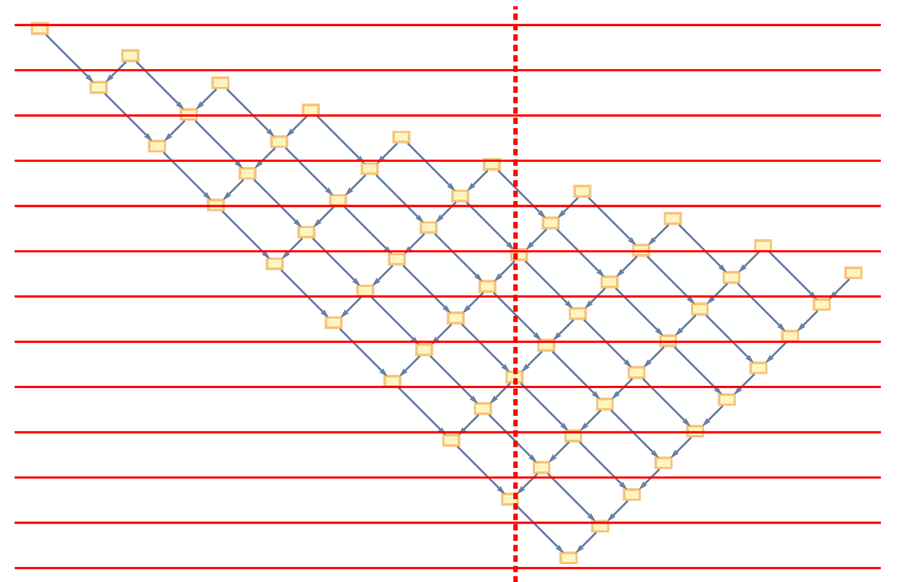

1. 【译注】“超边”其实就是对“边（edge）”的扩展。在图论中，一条边（edge）连接的永远只能是两个节点，长度永远为1；“超边”的概念允许将好几条边抽象成一条边来处理，而在这个基础上产生的图就可被称为“超图”。比如，上面提到的关系集合是{{1,2,3},{3,4,5}}，那么观察这张超图，其中就有两条超边——一条从1到2再到3，另一条从3到4再到5。

2. 【译注】“膜”指的就是浅蓝色面积区域。因为超边的长度大于1，所以要可视化当然需要一些超出边本身的额外结构。</small>

3. 【译注】我有种在翻译《新科学》的错觉。他在[基本思想纲要：新科学之基础(三)](ANewKindOfScience/0004.html)里说过几乎一样的话。

 4. 这里解释一下计算不可约化性的概念。举个不是很恰当的例子，当我们给一个数加上1，减去2，再乘3，这个操作可以被约化（reduce）为减1，再乘3，此时我们称这段程序是可约化的（reducible）。Stephen Wolfram认为，传统数学中的公式、方程，本质上是在对简单规则迭代的结果进行类似的约化。最简单的例子，例如一个单纯保持不变的变换规则，它在不断迭代下产生的行为就可以被约化成一条恒等式，或一条守恒定律。但是他认为，这种情况永远只是少数情况。在其它情况下，约化将会碰到一个极限，此时系统就会进入不可约化（irreducible）的状态。对于一个不可约化的系统，我们已经不可能通过任何方法进一步减少其运算步，而由于前面已经说了，公式和方程本质上是约化操作，这意味着面对这种情况，传统数学在原则上是无能为力的。就像我们不可能只用一个数据块的一部分就算出它的散列函数一样，我们也不可能只用规则迭代的初始状态计算出之后任意步的状态。我们能做的就是，从完全相同的规则出发，一步一步推导。假设一个不可约化的系统自己通过迭代了t步环环相扣的计算，达到它的结果，那么我们想预见那个结果，至少也得消耗t步的计算量。

5. 我们已经知道，在d维欧氏空间中，半径为r的球体的体积与r<sup>d</sup>成正比、边长为a的正方体的体积与a<sup>d</sup>成正比。这就存在着一种推广，这种推广认为，如果我们在一个度量空间中，发现一个“半径”为r的“球体”的“体积”为V，或者一个“边长”为a的“正方体”的“体积”为V，那么它的维度就是`Log[V, r]`，或者`Log[V, a]`。真实情况比这要复杂，涉及到豪斯多夫测度，但是简化来说可以这么理解。

    于是，测量维度的方法我们就搞清楚了。再下一步，是把“球体”、“半径”、“体积”等概念推广到超图空间中。

    我们发现，欧氏空间中半径为r的二维球体（即圆形）可以看成是从一个平面点出发，以一切可能性——也就是向所有方向——扩张距离r之后经过的所有点的集合，而这个集合的勒贝格测度就是这个球体的体积；同理，半径为r的三维球体的体积，可以看成是从一个三维空间中的点出发，以一切可能性扩张距离r之后经过的所有的点的集合的勒贝格测度，如此等等。

    于是推广到超图空间，我们可以用一个类似的操作来制造半径为r的球体：从超图中的一个节点出发，以一切可能性——也就是向所有连接到它的节点扩张距离1，再将这个过程重复r次就是扩张距离r。经过的所有点的集合，就是我们模拟出的、超图空间中的球体；而这个集合的测度，应该就是所谓的体积了。具体使用哪种测度呢？在欧氏空间中，如上所说，使用的是勒贝格测度，但是在超图空间这样的可数集构成的离散空间里，任何子集的勒贝格测度都是0。作者在这里使用的测度简单地等于它的势，专业术语叫计数测度。

6. 上面“两个贡献量”那段其实就是在说，这个平面内球体的增长率同时是**空间维度**和**空间曲率**的函数。这个函数的特点就是，其中占支配地位的是**空间维度**，而**空间曲率**的影响相对较小，而且还是个负项。那么到了下面的测量，我们知道结果是这条函数曲线是向下垂，维度基本保持不变的情况下，下垂基本是负项的效果，说明负项起的是**减法**的贡献，也就变相说明**空间曲率**是正的了。

7. 【译注】这里这串

    ```mathematica
    f[n_]:=f[n-1]+f[n-2]
    ```
    其实是Mathematica代码，这是一个函数定义。数学上相当于表达式

    

    聪明滴小朋友估计已经看出来了，这是一个类[斐波那契数列](https://en.wikipedia.org/wiki/Fibonacci_number)（当n为整数时）。这种数列满足任一项等于前两项之和。当f(0)=f(1)=1，也就是前两项是1的时候，得到的就是正宗的斐波那契数列（上面Wolfram用的也是）。


8. 这一部分的逻辑跨度有点大，我脑补不出推理过程，所以接下来的部分并不像之前一样是“解释”，最多算“猜测”，因为这回我自己并不是很确定。

    我认为这里其实和观不观察者的并没有什么联系。因为狭义相对论原则上并不需要观察者——它说的是不同参考系中的时间流动速度。上面那一段说的意思，可以拆成两部分：

    第一，观察者思维流动的速度跟时间流动的速度一样。这总结的是上面的第一句话；第二，时间就是因果图，因果图就是时间，它们就是同一个东西。这总结的是上面的后三句话。

    首先我觉得第一句话的命题是平凡的。因为从狭义相对论诞生那天起，这句话在物理学里就本来都一直是对的。思维当然会像其它任何物理现象一样受到时间流动速度的影响。

    而后一句话，我要非常详细地扯一下。在这个模型里时间是离散的，每一个时间步就是一次更新。但是请注意：这只解释了时间内禀的、向前流动性质的来源，仅此而已。它只是说明了时间存在的根本是规则的替换，是每一次替换的那一个“tick”导致了变化，而变化即是时间——但是！它对于时间流动的速度没有作出任何预测。所以如果你单纯地把时间流动的速度看作是每一次迭代的速度，那你绝对就理解错了——因为在这样的宇宙里全局的时间都是一样的，大家都是一起“tick”，规则都是一起应用。而且换个角度说，在这样的观念里，时间跟空间压根半毛钱关系都没有，时间是超越空间的存在，这是妥妥地牛顿绝对时空观的翻版，显然不可能产生任何类狭义相对论的东西。

    那么该如何在这个模型中引入时间的相对性呢？狭义相对论在本质上是给时间找到了空间的一面。因此，我们的思路也就是——想办法让时间和空间“有一腿”。

    而因果不变性就提供了这样一种时间和空间之间的重要联系。我猜作者的想法就是：时间不是“tick”本身。时间是变化的“事件”。放到图里来说就是：

    

    但是我还是什么都没解释丫，**凭什么**时间是这一大坨？时间是这一大坨**又怎样**？

    我先解释第一个问题，为什么时间是这一大坨。首先，前面已经说了，如果我们使用最底层的那个tick的时间，结果就是这个宇宙绝对不会是相对论性的。那么很显然，我们需要定义在**更高层级**的时间，这是一个潜在的启发点。另一方面，哲学家曾经为时间的定义争论了很长时间。其中一种观点就认为，时间即变化。很好理解，因为**如果变化绝对不存在，就无所谓时间流动与否**。这个观点非常重要。让我们仔细看看这张图：

    

    注意我标出的这几列。它们是不是都不再变化了？右边相对称的部分也是如此。**尽管规则还在“应用”，时间轴还在继续向下“滚动”，但是这些列都不会再发生任何变化了。** 看看最后一行，哪怕我们继续往下“tick”，继续迭代应用规则，继续向下推进时间轴，可以预见也不会有任何变化——因为整个字符串已经排列好了。如果把这字符串看作一个一维宇宙，那么，**整个宇宙看起来像是从此被冻结了。**

    任你时轴无限推进，我自保持永恒静止。

    再回想一下之前的那个观点：如果变化不存在，实际上就无所谓时间流动与否——没错，时间就是静止了。不仅是整个宇宙在这之后时间静止了，看上图中的第一列，它其实在第三步之后就已经陷入了永恒的时间静止；第二列则要更晚一点，第三列更晚……如此等等。

    

    再看看我随便标记的一些红色的列。所以还不止刚才那些，同一列内上下两个黄色的“变化事件”之间，也全是没有任何变化的列。可以注意到，实际上，整张图排除了黄色的“事件”，其实都是孤立的、时间静止的块。现在你应该理解了为什么我说作者的意思是“时间即是因果图，因果图即是时间”。

    下面我来解释第二个问题，时间是因果图意味着什么呢？我前面说了，因果图为我们把空间和时间联系起来构造了一条重要的桥梁。实际上，**它让时间具有了形状**。吐槽一句，这句话光是听着就很相对论了。说它让时间有了形状，原因既有浅层的，也有深层的：浅层原因很弱智，因为时间就是因果图，因果图有形状，那时间当然也有，这是小学生水平的逻辑学；而深层原因则在于，刚才说了，整个时间演化图上黄色的部分以外的地方都是时间静止的，或者换一个哲学术语，叫作“时间真空”。这意味着，其实它们等于不存在——它们是无法被感知的，它存在等于不存在，因为在这样的时间真空里，思维乃至一切过程都无法进行。在身处宇宙中的人看来，即使用最精密、频率最高的仪器来检测，这样的时间真空也无法测知——因为仪器里的物理过程的粒度也是因果图级别的，而不是tick级别的，仪器需要“变化”来完成检测进程。于是，我们抽象出的因果图中的红线

    

    是瞬间发生的。在宇宙里的人感知里（假设他们牛逼到可以一个不落地检测每一个黄色的事件），这些事件是紧紧挨着一件接着一件发生的。红线对他们来说并不存在。

    但是，关键在于，这似乎产生了矛盾：你说红线是感知不到的，那么在

    

    这个分岔中，下左、下右两个事件都是在上面的事件发生后瞬间发生，问题来了，它们一个在时间轴的上面，一个在时间轴的下面。它们到底该同时发生还是先后发生？

    其实这正是我说时间有了形状的意义。我们应该换一个角度来考虑：同样是进行一次“下一个瞬间”的操作，左边，或者说**在空间上**x坐标更小的地方，下一个瞬间来得更慢；而右边，在空间上x坐标更大的地方，下一个瞬间来得更早一些。实际上这意味着，在这个时间点上，左边这个位置的时间流逝得比右边要快。**时间流逝的速度现在具有了相对性！** 

    上面说的这种相对性，是针对同一张因果图，在不同空间位置上的时间相对性。另一方面，自然也存在着不同因果图，在同一空间位置上的相对性。注意，因果图决定“时间流逝速度”的是因果图的疏密、形状，因此我们可以说，对因果图的扭曲操作，本质上就是一种参考系变换。记住这个结论。

    时间的形状除了能带来时间流逝速度的相对性，还能带来相对论的另一个重要结论，即**同时的相对性**。只需要注意到所谓同时事件就是在时间轴相同高度发生的事件。然而因果图的形状是可以扭曲的——如上面三张图。这就意味着在某张因果图——即某个参考系——下看到的所谓“同时事件”，在扭曲——即参考系变换——下，完全可以在不同时刻发生。

    另外，因果图中还暗含了一个玩意，这也是相对论最广为人知的结论之一——因果链存在速度上限，这个速度即光速。首先刚才我说了，红线拉得越长其实就是瞬间之间更长，时间过得更慢。这样一来，红线越短，当然就是瞬间之间更长，时间过得更快。下一步，只需要意识到，因和果发生的间隔不可能小于一个tick——这是时间的最精细层次。

    讲到这里，是不是开始有内味了，甚至有点想感叹“可以，这很爱因斯坦👍”？

    当然，到了这里我只是定性分析。接下来还得继续往下翻译，看看Wolfram本人是怎么写的。其实也有可能我猜的都是错的
    （然而我真的越写越觉得自己贼有道理 啊 我真实太强了 万一人家说得和我不一样绝对是他错了👍）

    <hr>

9. 很遗憾，他的说法跟我的说法虽然不冲突，但是明显对时间有着不同的理解。他仍然认为时间是从上至下的那个tick时间，而相对论中的时间相对性是由于观察者的感知模型基于因果图，所以能感知到时间的相对论性变化。

    而我比他的看法要更加激进。我认为（并且现在还在这样认为），其实根本不需要观察者，如果我们根据“时间就是变化”来定义一个等效时间，这个等效时间完全就等价于因果图。那么他论证所用到的这个观察者（连带他对时间的心理观念）是可以直接抛弃的。

    其它结论一样可以推出来，所以在其它方面上我们是一致的。但是我认为宇宙本身并不需要一个观察者来“感知”这个等效时间——这个等效时间应该就是这个宇宙中的所有物质表现出的真正时间流动速度。

10. 看吧！我就说其实可以把整个时间直接定义为因果图嘛。

    这里我系统解释一下他上面说的内容，包括上面老是提到的“取样（sample）”到底是在说啥。如果你知道什么是闵可夫斯基图，那你应该在他说的时候就看懂了，就可以跳过这一段注释了。

    首先我们想象一下，从上往下有一系列均匀向下执行的事件链条。如果观察者保持静止，结果就像

    

    其中，**垂直红虚线和竖直方向的夹角代表速度**，竖直向下代表速度为0。这张图显示的一样：一行一行按同时顺序执行，没有什么问题；但是如果他匀速向左运动呢？对于空间上位于他**左**边的事件来说，他和这个因果事件是相互靠近的，所以比静止时更**早**发生了；对于空间上位于他**右**边的事件来说，他和这些因果事件是相互远离的，所以比静止时更**晚**发生了。左边更早，右边更晚。所以结果才会是下面这张图：

    

    这张图具体怎么理解呢？其实就是同一条红线代表同时发生的事情，越往上的红线代表越早发生的事情，即Wolfram所说的“时间切片”。而因为左边更早了，所以左边位于红线中更高的部分；右边更晚了，所以右边在红线里位于更低的部分。这张图其实怎么画都可以，但是由于一个浅显到无聊的原理——**任何参考系以自己为参考系都是静止的**~~（我相对我自己？）~~，所以对于这个运动参考系本身来说，比较合适的画法应该是让那条**垂直的红虚线竖直往下**：

    

    所以下面这张图其实只是上面那张图按照红线扭正了罢了。那么那个什么“采样”说的又是啥呢？其实很简单，采样=在一个集合里抽出一部分。注意到原本静止时，第一行发生的事件有10个：

    

    但参考系具有向左的均匀速度时，第一行发生的事件只有一个：

    

    并且这一个事件来源于原本的10个之中。这个过程就是所谓的采样。那么为什么前面说采样率是</img>呢？

    首先搞清楚β是啥。

    

    在这张“上帝视角图”中，

    我们可以把静止参考系中的时间片（红箭头）看作运动参考系中的同一个时间片（蓝箭头）的投影，假设它们间的夹角为θ。那么显然，蓝箭头相比红箭头的“膨胀率”为cos θ。
